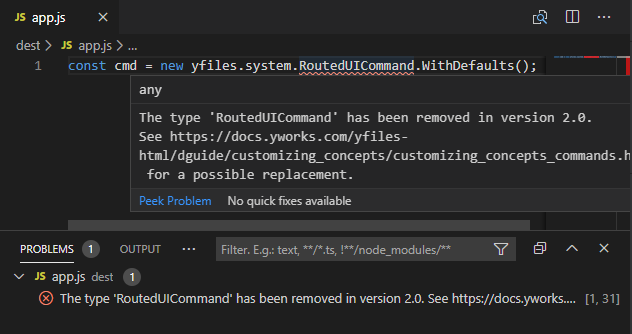

# yFiles for HTML migration tool
Migrate outdated yFiles for HTML code to **yFiles for HTML 2.3**.

The source of this tool is available at [GitHub](https://github.com/yWorks/migrate-yfiles-app). 

## Usage

1. Install the migration tool globally: 
   
   `npm install -g @yworks/migrate-yfiles-app`
   
2. Migrate your project: 

   `migrate-yfiles-app --src=./src --dest=./src-migrated --from=1.3`    
   
The output of the tool includes code locations in a simple format that will be recognized by most IDEs 
(e.g. VS Code, Webstorm), so you can click on output lines to migrate the corresponding code manually.   

## Incremental Mode

The tool offers an incremental mode where it will not actually transform your files, but will only output 
messages that describe what has to be changed at which location. This allows you to migrate your app iteratively, until no such messages are printed anymore. The messages usually take the following form:

```
The thing 'oldThing' has been changed to 'newThing' in version <versionNumber>. [additional information here.]
  at <absolute path to file, including line and column numbers>
```

We recommend running the tool once in non-incremental mode to get the automatic code changes, and afterwards running
it in incremental mode to migrate the things that could not be handled automatically.

Messages can also be suppressed by putting a comment with the content `@migration-ignore` above the line where the message occurs.
This is useful if you are sure that the code is already correct. 

## Command Line Arguments

### Required Arguments

|      |     |     |
| ---  | --- | --- | 
| `-f` | `--from` | The version of yFiles for HTML from which to migrate. Available options: 1.3, 1.4, 2.0, 2.1 |
| `-s` | `--src`  | The input file/directory to be transformed. |
| `-d` | `--dest` | The destination directory where all transformed files will be written to.<br>This has to be empty unless the `--incremental` or `--force` options are specified. |


### Optional Arguments
|     |     |     |
| --- | --- | --- | 
| `-i`  | `--incremental` | Run the migration tool in [incremental mode](#incremental-mode). |
| `-e`  | `--extensions`  | Which file extensions to transform. Default: `.js` and `.ts`|
| `-l`  | `--singleline`  | Write log messages in a single line instead of printing the source location to a second line. |
| `-v`  | `--verbose`  | Log verbose jscodeshift messages |
|       | `--force`       | Overwrite files in the destination directory.
| `-nc` | `--nocolor`     | Don't colorize the log messages. |
|       | `--version`     | Show the version number. |
|       | `--help`        | Show help. |
| `-t`  | `--transforms`  | Which transforms to apply. |

## Logging Debug Messages

The migration tool uses the [npm debug module](https://www.npmjs.com/package/debug) to log debugging information in individual transforms. To enable all debug messages, set the `DEBUG` environment variable to `migrate-yfiles-app:*`. This will output all migration tool debug messages. To restrict the debug output to a specific
feature/transform, use the corresponding specifier, e.g. `DEBUG=migrate-yfiles-app:toEs6Class`.

## VS Code Problem Matcher

Navigating possible problems detected by the migration tool can be facilitated using a problem matcher in VS Code. 
The messages are summarized by file in the problems panel, and the corresponding sections are highlighted in 
the source code:



To enable problem matching in VS Code, add a task with the [matcher definition](https://code.visualstudio.com/docs/editor/tasks#_defining-a-problem-matcher) to your [`.vscode/tasks.json`](https://code.visualstudio.com/docs/editor/tasks) file:

```json
{
  "version": "2.0.0",
  "tasks": [
    {
      "label": "Run yFiles migration tool",
      "type": "shell",
      "command": "migrate-yfiles-app",
      "args": [
        "--src=app-src",
        "--dest=dest/",
        "--from=1.3",
        "--force",
        "--singleline" 
      ],
      "problemMatcher": {
        "fileLocation": ["absolute"],
        "pattern": {
          "regexp": "^(.*?):(\\d+):(\\d+)\\s-\\s(.*)$",
          "file": 1,
          "line": 2,
          "column": 3,
          "message": 4
        }
      },
      "presentation": {
        "clear": true,
        "showReuseMessage": false
      }
    }
  ]
}
```
